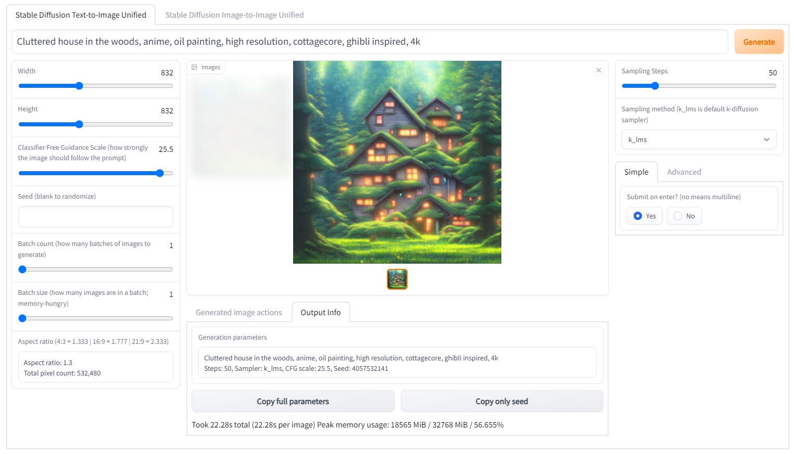

# Stable Diffusion on Kubernetes with Helm

Run Stable Diffusion with companion models on a GPU-enabled Kubernetes Cluster - complete with a [WebUI](https://github.com/hlky/stable-diffusion-webui) and automatic model fetching for a 2 step install that takes less than 2 minutes (excluding download times).

Uses the `nvidia/cuda` image as a base.

### Features

-   Automatic Model Fetching
-   Works with `gpu-operator`, bundling CUDA libraries
-   Interactive UI with many features, and more on the way!
-   GFPGAN for face reconstruction, RealESRGAN for super-sampling.
-   [Textual Inversion](https://github.com/hlky/sd-enable-textual-inversion)
-   many more!

### Prerequisites

-   Kubernetes Cluster with GPUs attached to atleast one node, and [NVIDIA's `gpu-operator`](https://github.com/NVIDIA/gpu-operator) set up successfully
-   [`helm`](https://helm.sh/docs/intro/install/) installed locally

## Setup

-   Add the helm repo with `helm repo add amithkk-sd https://amithkk.github.io/stable-diffusion-k8s`
-   Fetch latest charts with `helm repo update`
-   (Optional) Create your own [`values.yaml`](./charts/stable-diffusion/values.yaml) with customized settings
    -   Some things that you might want to change could include the `nodeAffinity`, `cliArgs` (see below) and `ingress` settings (that will allow you to access this externally without needing to `kubectl port-forward`)
-   Install with `helm install --generate-name amithkk-sd/stable-diffusion -f <your-values.yaml>`

Wait for the containers to come up and follow the instructions returned by Helm to connect. This may take a while as it has to download a ~5GiB docker image and ~5GiB of models

## Config

By extending your `values.yaml` you can change the `cliArgs` key, which contains the arguments that will be passed to the WebUI. By default: `--extra-models-cpu --optimized-turbo` are given, which allow you to use this model on a 6GB GPU. However, some features might not be available in the mode.

[You can find the full list of arguments here](https://github.com/hlky/stable-diffusion/blob/c5b2c86f1479dec75b0e92dd37f9357a68594bda/scripts/webui.py)

## FAQ

-   To enable [Textual Inversion](https://github.com/hlky/sd-enable-textual-inversion) remove `--optimize` and `--optimize-turbo` flags and add `--no-half` to `cliFlags` when installing, [more info here](https://github.com/AbdBarho/stable-diffusion-webui-docker/issues/6).
-   If [output is a always a green image](https://github.com/AbdBarho/stable-diffusion-webui-docker/issues/9), use `--precision full --no-half`.

# Disclaimer

The author(s) of this project are not responsible for any content generated using this interface.

# Thanks

Special thanks to everyone behind these awesome projects, without them, none of this would have been possible:

-   [hlky/stable-diffusion-webui](https://github.com/hlky/stable-diffusion-webui)
-   [AbdBarho/stable-diffusion-webui-docker](https://github.com/AbdBarho/stable-diffusion-webui-docker/)
-   [AUTOMATIC1111/stable-diffusion-webui](https://github.com/AUTOMATIC1111/stable-diffusion-webui)
-   [CompVis/stable-diffusion](https://github.com/CompVis/stable-diffusion)
